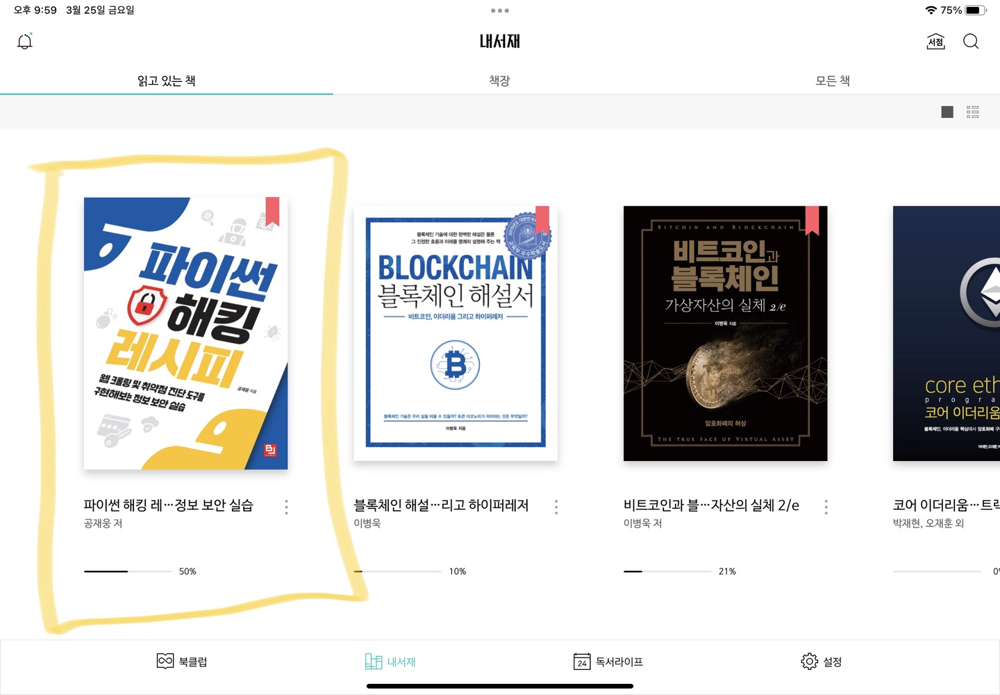

# HackRecipe

</img>

최근 반복되는 5개의 IP주소에서 api 요청시 쿼리에 랜덤한 값들을 넣고 요청하여 수천건의 에러를 일으킨 것을 모니터링 하였습니다.  
이것을 일종의 공격으로 판단하여 해킹을 공부해보기로 마음 먹었습니다.  

잠시 훝어보았는데 제가 당한 공격이 SQL Injection 이라는 걸 알고 매우 흥미로웠습니다.  

챕터1에서는 "해킹은 무엇인가" 에 대한 설명과 
챕터2에서는 VScode 설치 및 환경설정을 
챕터3에서는 기본적인 파이썬 문법에 대한 설명이었습니다. 
여기까지는 대부분 알고있던 지식이라 빠르게 읽고 넘어갔습니다.  

챕터4부터는 소스파일 하나하나 실행해가면서 동작을 이해하면서 학습했습니다. 
컴퓨터가 두대있었으면 하는 약간의 아쉬움이 있었지만 학습하는데는 문제없었습니다. 
OSI7layer, TCP/IP를 다시 복습할 수 있었고 ICMP, Sniffer, covert chnnel, ping sweep scanner 등 
네트워크와 관련된 많은 새로운 지식을 얻을 수 있었습니다.  
pyinstaller로 실행파일도 만들고  
마지막으로 비동기TCP포트 스캐너까지 구현하며 챕터4를 마무리 하였습니다.  

챕터5는 매우친숙한 웹크롤링 관련이었습니다. 
robots.txt와 크롤링윤리부터 클라이언트 저장소까지 대부분 아는 개념이었지만, aiohttp라는 모듈은 처음 보았습니다. 
이는 비동기를 이용한 크롤링을 빠르게 수행하는 모듈인데 만약 혼자하는 프로젝트가 있다면 구현해보기 좋겠다 라는 생각을 했습니다. 
회사에서는 다른방식으로 충분히 비동기 크롤링을 구현할 수 있으니 말이죠.  

다음은 챕터 6...

